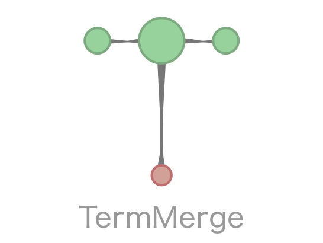

## NLPCore Service
Core Kernel Server that orchestrates all the low-level data crunching work needed for reporting, 
storing and running queries about **word convergences**. NLPCore obtains reported word convergences 
placed on Apache Kafka and stores them on an immutable distributed file dataset as well as mutates the necessary 
databases

Service consumers can:
* Hook up to TermMerge's NLPCore Service using **WebSockets** to get live analytics on reported word convergences
* Query for word convergences based on given properties like **convergence radius** (aka cloud of words that are 
_ steps correlated away with another word)
* Issue out heavy computation-based work that the Kernel Server is in charge of dispatching and aggregating

### Dependencies
* [Apache Zookeeper](http://zookeeper.apache.org) - abstraction for orchestrating distributed tasks (regardless of whether those tasks are partitioned across processes, servers or even networks)
* [Apache Curator](http://curator.apache.org) - abstraction over Apache Zookeeper for making cluster orchestration tasks like leader election, distributed locks and group membership very trivial
* [Apache Kafka](https://kafka.apache.org) - distributed and exposed message platform that is alot like a first-in, first-out transaction log
* [TinkerPop](http://tinkerpop.apache.org) - eases graph-based computation that runs across supported graph-based querying engines and databases like Neo4J.
