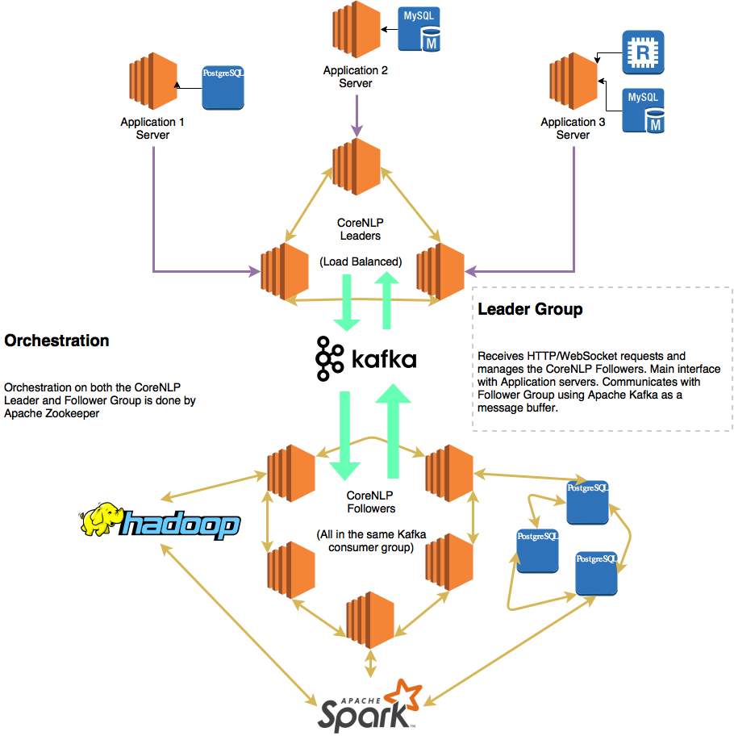

## NLPCore Service
Core Kernel Server that orchestrates all the low-level data crunching work needed for reporting, 
storing and running queries about **word convergences**. NLPCore obtains reported word convergences 
placed on Apache Kafka and stores them on an immutable distributed file dataset as well as mutates the necessary 
databases

Service consumers can:
* Hook up to TermMerge's NLPCore Service using **WebSockets** to get live analytics on reported word convergences
* Query for word convergences based on given properties like **convergence radius** (aka cloud of words that are 
_ steps correlated away with another word)
* Issue out heavy computation-based work that the Kernel Server is in charge of dispatching and aggregating

### Dependencies
* [Apache Zookeeper](http://zookeeper.apache.org) - abstraction for orchestrating distributed tasks (regardless of whether those tasks are partitioned across processes, servers or even networks)
* [Apache Curator](http://curator.apache.org) - abstraction over Apache Zookeeper for making cluster orchestration tasks like leader election, distributed locks and group membership very trivial
* [Apache Kafka](https://kafka.apache.org) - distributed and exposed message platform that is alot like a first-in, first-out transaction log
* [Apache TinkerPop](http://tinkerpop.apache.org) - eases graph-based computation that runs across supported graph-based querying engines and databases like Neo4J.

### Network Architecture

### Communication Protocol
At any point during runtime, **leaders** are elected among a quorum of NLPCore server instances. This quorum is managed by Apache Zookeeper using the Apache Curator abstraction. 

* The leaders can: 
  * Accept and give out both HTTP and Websocket requests/responses

* Followers turn into simple computation nodes that can run multiple tasks including:
  * Continously poll Kafka and store reported word convergences into their respective datastores.
  * Do graph-based computation
  * Use core Natural Language Processing tasks like tokenization, word splitting, part of speech tagging, lemmatization, named entity recognition, constituency parsing, dependency parsing, coreference resolution and many more!
  * Access stored WordNet and FrameNet models

Communication between leaders and followers are currently implemented by using Apache Kafka as the communication medium. This is because we are already using Apache Kafka for storing reported word convergences. Apache Kafka allows us to provide a buffering medium in case requests come in quicker than we can serve them especially considering that NLP tasks tend to be very intensive.
